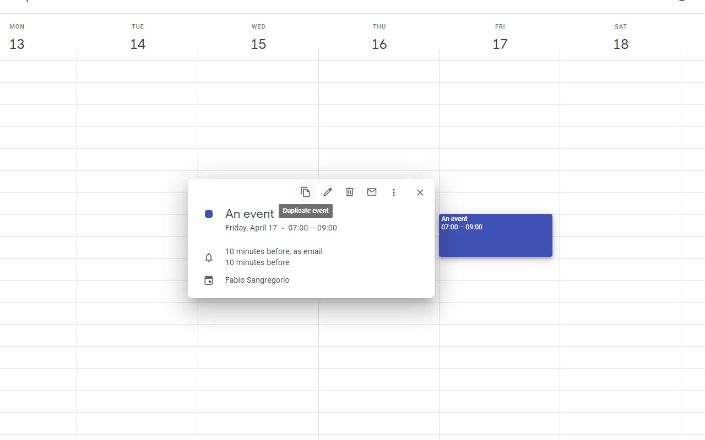

<h1 align="center">google-calendar-quick-duplicate</h1>

> A simple Chrome Extension to quickly duplicate events on Google Calendar.

## How it works
This extension adds a "Duplicate event" icon on the event preview card, letting you quickly duplicate it with one single click.

  

## Bugs and feature requests
For any issues, bugs and feature requests feel free to [open an issue](https://github.com/fabiosangregorio/google-calendar-quick-duplicate/issues) on Github.

